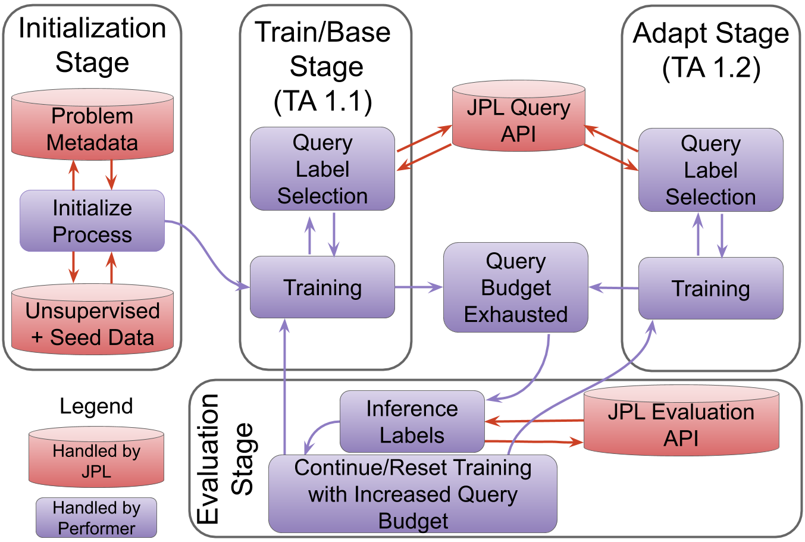

# Learn Framework

## Setting up your algorithm
The framework has three parts. The frameowrk itself is installed such that it can be executed from any desired location
on the system. The second part is the protocol. The protocol is written by the project team to meet the requirements of
the entire project. This is a python script that exercises all parts of the system in the desired fashion. The third 
part are the algorithms. The three parts of the system do not need to be in the same location. The only requirement
for the algorithms is that they all reside under the same root folder. Either the framework should be execued from this
base folder, or this base folder can be given as an argument to the framework. The location of the protocol script is
given to the framework as the only required argument.

```python
python3 main.py <protocol file>
```

There are five main files to look at here.  The only two files from listed below that you should be editing are the 
:ref:`algorithm.py` and `input.json`.  Look into the code/build the documentation for more information.  
- :ref:`main.py`: runs the experiment.  
    - Picks and initializes the problem
    - Initializes the classes for the dataset and algorithm
    - Runs the loops for the train and adapt stages.
- :ref:`problem.py`: problem (LwLL) class definition
    - Contains the problem/task information
    - Interacts with the JPL API
- :ref:`dataset.py`: dataset classes
    - Contains the classes for the train and eval datasets fore each stage.  
    - The dataset contain both unlabeled/labeled data
    - Connects with problem class to update the dataset based on the indices of the data.
- :ref:`algorithm.py`: algorithm class
    - This is the class you will be editing
    - This contains the calls for the train, adapt, and eval stages of your algorithm.
- `input.json`: parameters to run your algorithm
    - This contain the parameters such as learning rate and how many iterations to run for.  This is for runtime 
    arguments to control how the algorithm runs.   


The [VAAL algorithm](https://github.com/sinhasam/vaal) has been implemented here as an example. 
It is only an active learning approach and doesn't have any adaption mechanism so the train and adapt stages so these 
two methods are the same though that is just for this example.  All other files beyond the ones listed here are for the
VAAL algorithm and can be removed.  

### Problem 
This is the overall flow of the problem in this work.  

The flow is run from the :ref:`main.py` file generally and calls the :ref:`algorithm.py` methods for each step 
(the purple squares).    Please refer to the documentation of the files for more information.


## Running the code

to execute the code, run the main.py file with python 3 and two arguments giving the location and name of the
protocol file to use and the location of the algorithms directory: `python3 main.py <protocol file> -a <path to algorothms>`

```bash
python3 main.py example/learn/protocol/learn.py -a example/learn/algorithms
```

### Local Execution

First, install the learn_framework.
Make sure you have a virtual environment and that you are not not polluting your system python by installing 
dependencies.

```bash
cd learn_framework
pip install -e . 
```

When you are implementing your algorithm, you have to provide a "requirements.txt" file so that we can figure
out your algorithm's dependencies. In our case our dependencies file looked something like:

```
torch>=1.3.0
torchvision>=0.3.0
numpy>=1.16.4
scikit-learn>=0.21.1
scipy>=1.2.1
ubelt>=0.8.7
```

As you can imagine you can list any python dependency in your requirements.txt file.
Let's install the python dependencies of the algorithm.

```bash
cd algorithm
pip install -r requirements.txt
```

The next step is running the algorithm. We expect you to implement a main.py file that is 
executable which will execute your algorithm. Detailed instructions on how to modify the main.py 
file is documented in the file itself. 

```bash
python main.py
```

### Docker Execution

Docker execution mode is more targeted towards delivering your algorithm. You do not need to 
deal with anything Docker-related while developing your algorithm. Docker is only useful for delivery.
In order to do the docker execution we need to have docker installed. After installing docker,
we need to first build the docker image which contains our algorithm and its dependencies.  Please install
[nvidia-docker](https://github.com/NVIDIA/nvidia-docker) on your system to have GPU capabilities as well.

From the root of this repository (where Dockerfile is located) run:

```bash
docker build -t my_algorithm -t registry.lollllz.com/learn/framework:my_crazy_innovative_research_lab_some_algorithm .
```

Make sure you replace "my_crazy_innovative_research_lab_some_algorithm" with something descriptive about your research 
and your university/lab etc.

-t flag is used for tagging (naming) your docker image.
This command will create a docker image which will include dependencies of your algorithm as well
as your algorithm code.

Then simply run:

```bash
docker run --gpus all --ipc=host my_algorithm 
```

We prefer you run this command as a smoke test to make sure we can run what you are about to deliver to us.
This command will download the datasets to the container automatically. The `--gpus all` indicate which GPUs 
are used by the system and `--ipc=host` allows for multiple workers for the pytorch dataloader (it runs 
out of shared memory otherwise).  

If you want to use the datasets from your computer simply mount it to the container as a bind mount.
Make sure the second part of the bind mount is always "/datasets" since the framework in the container
assumes datasets are in the directory.

```bash
docker run --gpus all --ipc=host -v /some/directory/in/my/host:/datasets my_algorithm
```

### Delivering Containers

In order to deliver the containers to us, you have to run the following commands.

The first step is authentication:

```bash
docker login registry.lollllz.com
```

Note: The "Login Succeeded" just means that it has hashed your credentials.  It has yet to test your credentials on
the gitlab.  

The next step is pushing the docker image to our registry using the tag you defined in the previous command.

```bash
docker push registry.lollllz.com/learn/framework:my_crazy_innovative_research_lab_some_algorithm
```


### Downloading Datasets

To modify the directory to which the datasets will be downloaded, specify a variable in the input.json file 
like in the following example.  This defaults to `/datasets` otherwise.

```json
{"dataset_dir": "/home/johndoe/datasets"}
```

For the docker container build make sure this dataset_dir you have provided in the `input.json` matches with 
the bind mount in your container. 

```bash
docker run --runtime nvidia -v /home/johndoe/datasets:/home/johndoe/datasets my_algorithm
```

## Building the Documentation
To build the documentation from the root directory, run the following command: 
```bash
cd docs && make clean && make html && make latex && (cd build/latex && make ) 
```

You may then access the html docs at: `<project root>/docs/build/html/index.html`
or the pdf version at `<project root>/docs/build/latex/learn_framework.pdf`

Note: To add images, you need to add them both the root level image folder and the docs/sources/images folder.  

## Running software tests
Note: These are still a work in progress.  
To run the tests pip install development requirements.

```
cd algorithm
pip install -r requirements-dev.txt
```

To run the tests from the algorithms directory run:
```
pytest
```

To see the coverage run:
```
pytest --cov .
```
