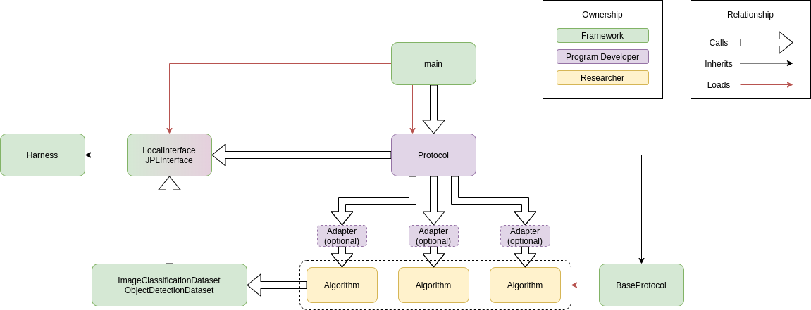

# tinker-engine

## Documentation for Examples

Check out the [examples](examples/) to get started using Tinker Engine.

## Developer setup

### Build Tinker Engine

The easiest way to build Tinker Engine locally is by using [poetry](https://python-poetry.org/docs/).
These steps will create a vistual environment where Tinker Engine is built and installed and
available for use.

1. Clone this repository.
2. In the `tinker-engine` directory, install the dependencies with
   `poetry install`.
3. Activate the virtual environment using : `poetry shell`.
4. Run Tinker Engine to ensure it works: `tinker --help`.

### Running Tinker Engine

There is an example protocol definition in
[`examples/helloworld/helloworld.py`](examples/helloworld/helloworld.py). You
can use this with Tinker Engine as follows:

```
$ tinker -c examples/helloworld/helloworld.yaml examples/helloworld/helloworld.py
```

Since Tinker Engine only finds a single protocol defined in the entrypoints
supplied to it, it will automatically instantiate and run the one it has found.
But you can also list the ones it knows about, like this:

```
$ tinker -c examples/helloworld.yaml examples/helloworld.py --list-protocols
```

### Other examples

The `examples` directory contains several protocols and configurations that you
can use to explore how Tinker Engine works.

#### Configuration Directives

The `examples/config` directory contains examples showing various configuration
directives, using a protocol that simple prints out the configuration passed to
it:

```
$ tinker -c examples/config/iterate.yaml examples/config/show_config.py
```

demonstrates how the `iterate` directive works combinatorially, and

```
$ tinker -c examples/config/iterate_nested.yaml examples/config/show_config.py
```

demonstrates the semantics of nesting one `iterate` directive within another.

When iteration is not needed, a "vanilla" configuration file will behave as
expected:

```
$ tinker -c examples/config/vanilla.yaml examples/config/show_config.py
```

##### SMQTK Directive 

The examples/smqtk folder contains examples of a SMQTK implementation,
SMQTK configuration files, and a protocol specifically for displaying
SMQTK instantiations.

From the root directory, we can test the SMQTK support.

```
$ SMQTK_PLUGIN_PATH=examples.smqtk.hello_smqtk tinker  -c examples/smqtk/hello_smqtk.yaml examples/smqtk/show_smqtk.py
```

### Command Line Documentation

```
usage: tinker [-h] -c CONFIG [--list-protocols] [--list-algorithms]
              [--log-file LOG_FILE] [--log-level LOG_LEVEL]
              protocol_file [protocol_file ...]

positional arguments:
  protocol_file         python file defining protocols/algorithms/etc.

optional arguments:
  -h, --help            show this help message and exit
  -c CONFIG, --config CONFIG
                        config file
  --list-protocols      Print the available protocols
  --list-algorithms     Print the available algorithms
  --log-file LOG_FILE   Path to log file
  --log-level LOG_LEVEL
                        Logging level
```

Generally, you will use the `tinker` utility by supplying a configuration file
with the `-c` option and at least one `protocol_file` listed as positional
arguments. Tinker Engine will read in the configuration file and use it to
instantiate a `Protocol` object defined in one of the `protocol_file`s listed.

The `--log-file` option sets a filename to use as the log file; by default it
will be a file named by the running computer's hostname and the current time.

The `--list-protcols` and `--list-algorithms` options are diagnostics to show
what has been detected by Tinker Engine. The options will, respectively, print
out all the `Protocol` and `Algorithm` objects found by Tinker Engine. These are
the objects available for use when Tinker Engine is run.

### Publishing on PYPI

Tinker uses github actions to publish packages on pypi. The action is triggered
when a [semver](https://semver.org/) tag is pushed to tinker.

We support the following version format `<major>.<minor>.<patch>` and
`<major>.<minor>.<patch>-alpha.<alpha-version>` for tags. To publish a package
on pypi, the tag must match with the version maintained in `pyproject.toml`.
This is implemented as a mandatory check in the workflow. Poetry provides support
for both querying and bumping version via cli. Please refer to
[version](https://python-poetry.org/docs/cli/#version) for more details.

Thus to publish tinker on pypi use the following commands

1. Bump the version in pyproject.toml using `poetry version <version_rule>`.
2. Use `poetry version --short` to determine the version that would be used in the tag.
3. Generate and push the tag using
   ```
    git tag <package-version>
    git push origin --tags
   ```


# Acknowledgments

This material is based upon work supported by the Defense Advanced Research
Projects Agency (DARPA) under Contract No. HR001120C0055 and research sponsored
by DARPA under agreement number FA8750-19-1-0504. Any opinions, findings and
conclusions or recommendations expressed in this material are those of the
author(s) and do not necessarily reflect the views of the DARPA. The U.S.
Government is authorized to reproduce and distribute reprints for Governmental
purposes notwithstanding any copyright notation thereon.

# IGNORE EVERYTHING BELOW

## Getting started

This repository contains a development version of the `tinker-engine` package.
To install it, make sure you are in your desired Python environment (e.g., by
creating a virtual environment), enter the top level directory of this
repository, and use `pip`:

```bash
pip install -e .
```

Once this is complete, you can execute protocols using Tinker Engine using the following command
```bash
tinker protocol_file
```
protocol\_file is the location and name of a python protocol file. The project administrator should provide the protocol script to the researchers for their local development. The protocol\_file can be either an absolute file path, or a path from the current working directory to the protocol file. Tinker Engine can be executed from any location, but it is recomended that it be run from the root of the algorithms directory.

If Tinker Engine needs to be run from somewhere other than the algorithms directory root, the path to the algorithms direcotry root should be provided using the -a argument

```bash
tinker protocol_file -a alogorithms_path
```
 
Tinker Engine can also be run with different harness interfaces. Use the -l flag to list the available interfaces. By default Tinker Engine uses the LocalInterface provided by Tinker Engine. An alternate can be selected using the -i \<interface name\> argument. User defined interfaces can also be used, but must derive from the Harness base class, and should be placed in the same folder with the protocol file. If everything is setup correctly, the -l flag will also print out the name of any user defined interfaces that are available.

## Running Learn

First, install Tinker Engine (instructions above). Next, check out the Learn
repository. Use the `pip` command to install the
Learn package: if the `tinker-engine` and `learn` repositories are in side-by-side
directories, and you are in the top-level directory of `tinker-engine`, then the
appropriate command would be `pip install -e ../learn`.

Then you will need to download all of the datasets and follow
instructions from: https://gitlab.lollllz.com/lwll/dataset_prep. Make sure the
`lwll_datasets` directory is in your current directory.

To run the learn protocol, invoke the `tinker` command as follows:
```bash
tinker ../learn/learn/protocol/learn_protocol.py -a ../learn/learn/algorithms
```

## System design
Tinker Engine has three parts. Tinker Engine itself is installed such that it can be executed from any desired location
on the system. The second part is the protocol and optional interfaces. The protocol is written by the project team to meet the requirements of
the entire project. This is a python script that exercises all parts of the system in the desired fashion. The project team may wish to also include simpler protocols that excercise just one algorithm at a time. This is useful for researchers when developing algorithms. Additionally, if the standard local interface test harness is not sufficient for the project needs, a substitute interface can be defined by the project team, as long as it inherits from the Harness class. The third part are the algorithms. The three parts of the system do not need to be in the same location. The only requirement for the algorithms is that they all reside under the same root folder, and any user defined interfaces must be in the same folder with the protocol file.

The basic design of the system is in support of a two tier system of users. The first tier are the project administrators. At this level, the experimental protocol is established and codified. To make this job easier, the final protocol code is written in python, and has very little restrictions to how it works. Tinker Engine itself mostly provides a support structure for the user written protocol file. The system diagram for this is:



Under this framework, the start of execution begins in the main.py, which locates, prepares and loads the protocol from the given protocol python file. It also loads the requested interface and supplies that to the protocol. The name of the file is provided by the end-user thorugh a command line argument, and the name of the class within the protocol file is unimportant (it will be loaded regardless of its name). Execution is then passed to the protocols run\_protocol function. The user protocol should inherit from tinker.BaseProtocol. the BaseProtocol provides access to the get\_algorithm function which will locate and dynamically load an algorithm on request. When the protocol needs to pass execution to a specific algorithm, it should call that algorithms "execute" function. One of the arguments to that function provides a step\_description which indicates what mode of processing the algorrithm should perform. In order to facilitate this behavior, every algorithm class must derive from tinker.BaseAlgorithm directly, or from an adapter class that derives from BaseAlgorithm. Like the protocol files, the name of the class in an algorithm file is ignored, and the class is loaded regardless of its name.

When implementing an algorithm, a "requirements.txt" file must be provided so that we can figure
out the algorithm's dependencies. An example dependencies file looks something like:

```
torch>=1.3.0
torchvision>=0.3.0
numpy>=1.16.4
scikit-learn>=0.21.1
scipy>=1.2.1
ubelt>=0.8.7
```

## Acknowledgement of Support and Disclaimer

This material is based upon work supported by the Defense Advanced Research
Projects Agency (DARPA) under Contract No. HR001120C0055. Any opinions, findings
and conclusions or recommendations expressed in this material are those of the
author(s) and do not necessarily reflect the views of the DARPA.  

This material is based on research sponsored by DARPA under agreement number
FA8750-19-1-0504. The U.S. Government is authorized to reproduce and distribute
reprints for Governmental purposes notwithstanding any copyright notation
thereon.  
