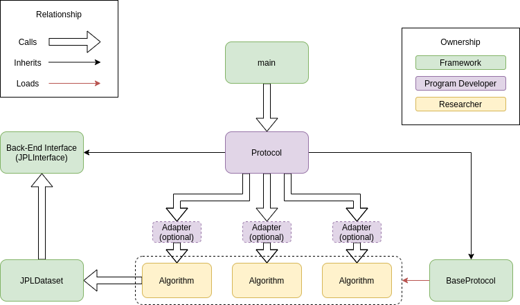

# Learn Framework

## Getting started
To install the framework, simply use pip to install from the root of the project
```bash
pip install .
```

Once this is complete, you can execute protocols using the framework using the following command
```bash
framework protocol_file
```
protocol\_file is the location and name of a python protocol file. The project administrator should provide the protocol script to the researchers for their local development. The protocol\_file can be either an absolute file path, or a path from the current working directory to the protocol file. The framework can be executed from any location, but it is recomended that it be run from the root of the algorithms directory.

If the framework needs to be run from somewhere other than the algorithms direcotry root, the path to the algorithms direcotry root should be provided using the -a argument

```bash
framework protocol_file -a alogorithms_path
```

# Running Learn

First, install framework (instructions above).  Then you will need 
to you need to download the dataset and follow instructions from:
https://gitlab.lollllz.com/lwll/dataset_prep

Once these are installed, please update the dataset directory in 
`example/learn/protocol/learn.py`.  You can change parameters there.


For example, to run learn, please run:
```bash
framework example/learn/protocol/learn.py -a example/learn/algorithms/
```

## System design
The framework has three parts. The framework itself is installed such that it can be executed from any desired location
on the system. The second part is the protocol. The protocol is written by the project team to meet the requirements of
the entire project. This is a python script that exercises all parts of the system in the desired fashion. The project team may wish to also include simpler protocols that excercise just one algorithm at a time. This is useful for researchers when developing algorithms. The third part are the algorithms. The three parts of the system do not need to be in the same location. The only requirement for the algorithms is that they all reside under the same root folder.

The basic design of the system is in support of a two tier system of users. The first tier are the project administrators. At this level, the experimental protocol is established and codified. To make this job easier, the final protocol code is written in python, and has very little restrictions to how it works. The framework itself mostly provides a support structure for the user written protocol file. The system diagram for this is:



Under this framework, the start of execution begins in the main.py, which locates, prepares and loads the protocol from the given protocol python file. The name of the file is provided by the end-user thorugh a command line argument, and the name of the class within the protocol file is unimportant (it will be loaded regardless of its name). Execution is then passed to the protocols run\_protocol function. The user protocol should inherit from both framework.BaseProtocol and a specific back-end interface such as the JPLInterface. the BaseProtocol provides access to the get\_algorithm function which will locate and dynamically load an algorithm on request. When the protocol needs to pass execution to a specific algorithm, it should call that algorithms "execute" function. One of the arguments to that function provides a step\_description which indicates what mode of processing the algorrithm should perform. In order to facilitate this behavior, every algorithm class must derive from framework.BaseAlgorithm directly, or from an adapter class that derives from BaseAlgorithm. Like the protocol files, the name of the class in an algorithm file is ignored, and the class is loaded regardless of its name.

When implementing an algorithm, a "requirements.txt" file must be provided so that we can figure
out the algorithm's dependencies. An example dependencies file looks something like:

```
torch>=1.3.0
torchvision>=0.3.0
numpy>=1.16.4
scikit-learn>=0.21.1
scipy>=1.2.1
ubelt>=0.8.7
```

